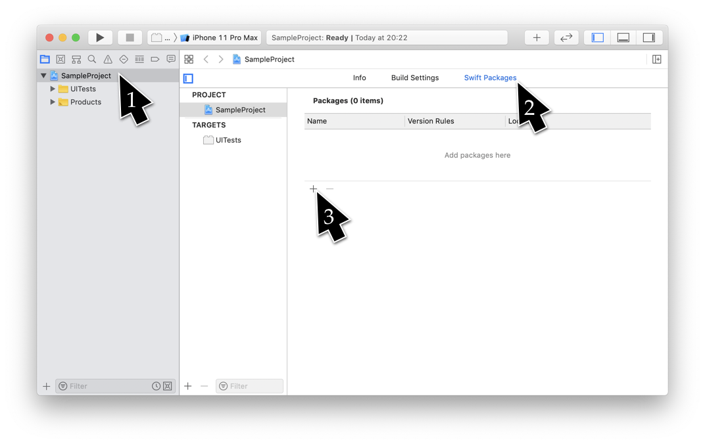
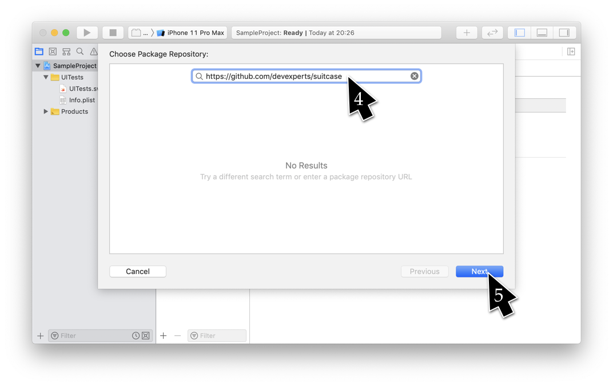
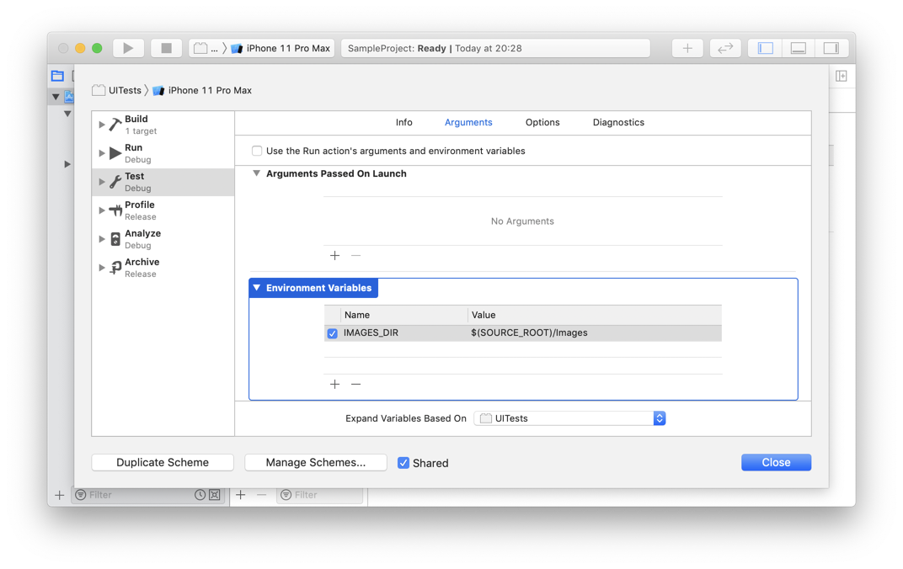
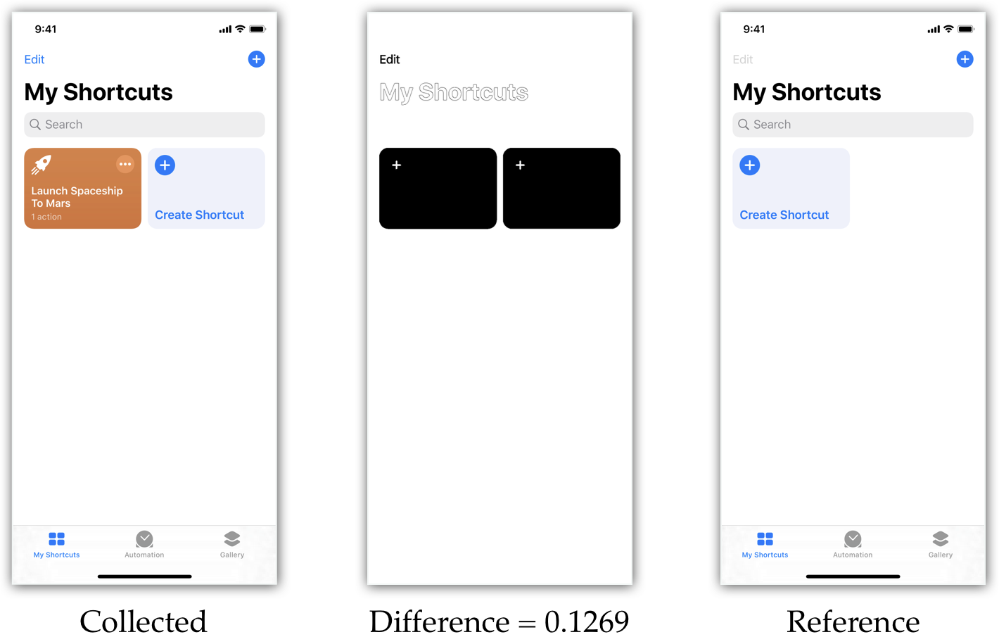
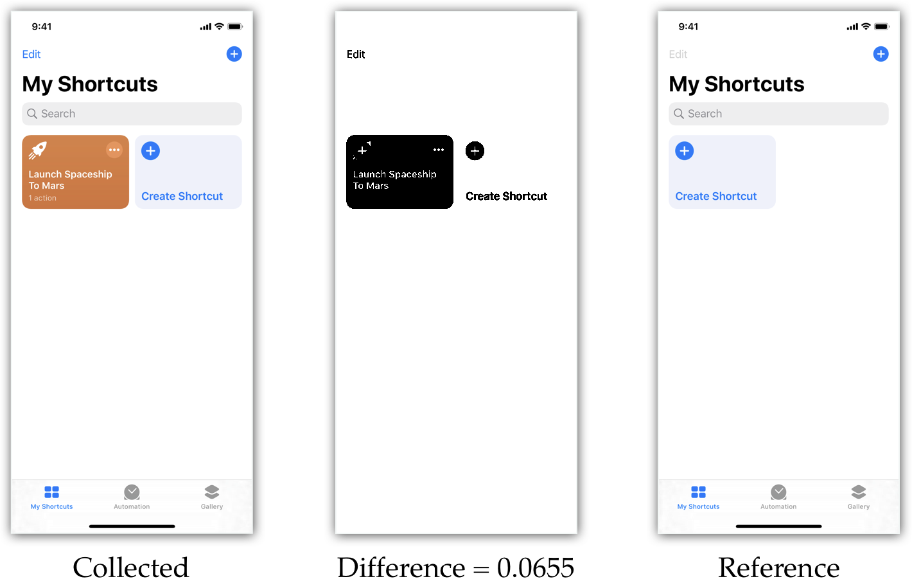
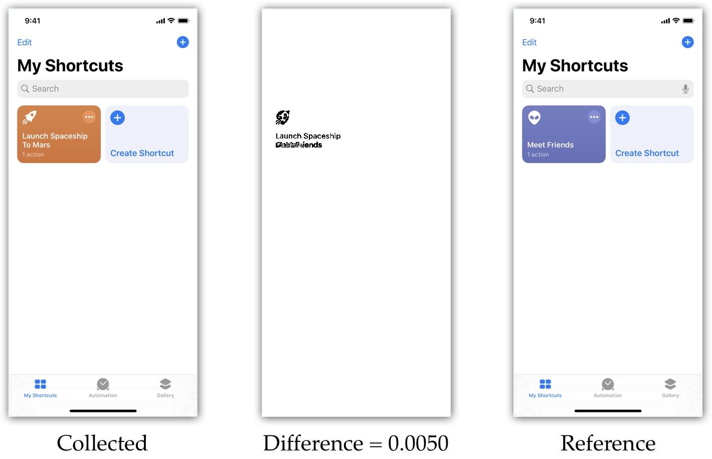
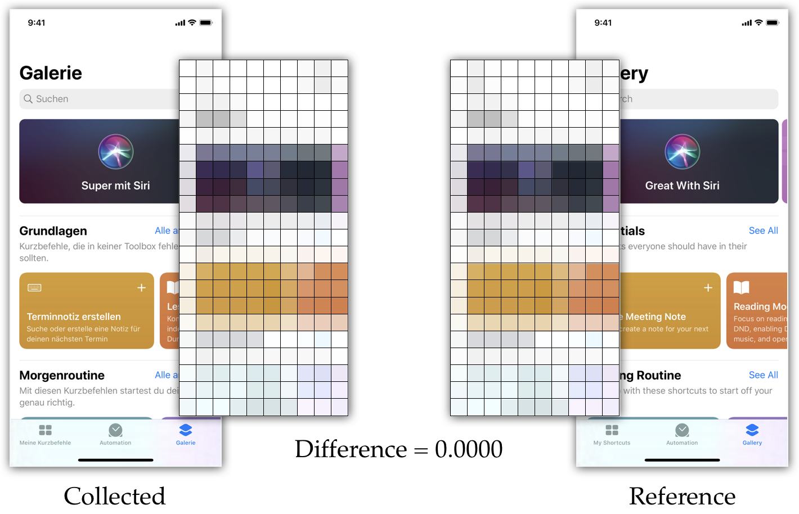
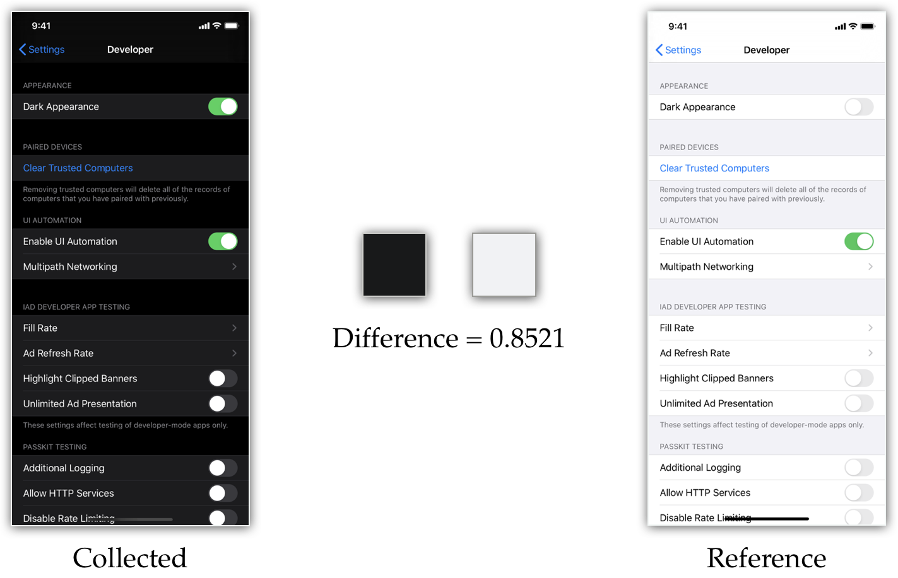

# SUITCase (ScreenshotUITestCase)
---
SUITCase can verify screenshots in five different ways while testing the User Interface of iOS, iPadOS, and tvOS apps in Simulator. 
It has been designed to be used with XCTest and written in Swift.


## Usage
Built-in XCTest assertions are great for many cases when you automate user interface testing. 
But some cases require testing appearance because `XCUIElement` properties do not fully describe the interface. 
SUITCase verifies screenshots to automate testing formatting texts, displaying images, switching themes, and much more. 
SUITCase currently supports recording and testing apps in Simulator only. 

## Installation
SUITCase is easy to install with the [Swift Package Manager.](https://developer.apple.com/documentation/swift_packages) 
Navigate to project settings and add a package on **Swift Packages** page. 
Copy-Paste a link to this repository in the **Choose Package Repository** window. 
Continue configuring dependency as needed.




Finally, add the Environmental Variable **IMAGES_DIR** to your Scheme. 
If you want to keep your reference Images with your test code, you should probably set it to **$(SOURCE_ROOT)/Images**




## Your first test with SUITCase
1. Import `XCTest` and `SUITCase`
2. Define your testing class as a subclass of `SUITCase` (or replace `XCTestCase` with `SUITCase` if you change the existing class)
3. Use `verifyScreenshot()` to insert a screenshot assertion in test. 
4. Record the reference screenshot by enabling recording in `setUp()` by adding `screenshotComparisonRecordMode = true` line. 
5. Disable recording by removing this line and run your test. 
```swift
import XCTest
import SUITCase

class AppearanceTests: SUITCase {
    override func setUp() {
        super.setUp()
        // screenshotComparisonRecordMode = true
        XCUIApplication().launch()
    }

    func testMainScreen() {
        verifyScreenshot()
    }
}
```


## Features
### Recording
* Enable **reference screenshots recording** by adding `screenshotComparisonRecordMode = true` line.
* The recording is disabled by default. 
If the reference images are missing, SUITCase will save **the suggested screenshots** into the separate folder.
If the collected screenshots are **unexpected**, SUITCase will save them into another separate folder as well. 
* There are **three screenshots naming strategies** – by the device name, by the screenshot size (default), and manual. 
Change strategy by setting the `screenshotComparisonNamingStrategy` variable. 
* You can also provide **the custom labels** to the screenshots if you want to make multiple assertions in a single test. Just set the `withLabel` argument. 
```swift
screenshotComparisonNamingStrategy = .imageSize
XCUIDevice.shared.orientation = .portrait
verifyScreenshot(withLabel: "Portrait")
// Saves /Images/Reference/AppearanceTests/testMainScreen/Portrait/en_414x896.png

screenshotComparisonNamingStrategy = .deviceModelName
XCUIDevice.shared.orientation = .landscapeLeft
verifyScreenshot(withLabel: "Landscape")
// Saves /Images/Reference/AppearanceTests/testMainScreen/Landscape/en_iPhone_11.png

screenshotComparisonNamingStrategy = .manual
XCUIDevice.shared.orientation = .landscapeRight
verifyScreenshot(withLabel: "landscapeRight")
// Saves /Images/Reference/landscapeRight.png
```


### Thresholds
* Set **the global threshold** by changing `screenshotComparisonDefaultThreshold`.
If unchanged, the default threshold is equal to 0.01, which means SUITCase allows a 1 percent difference between collected and referenced screenshots. 
* You can set the **local threshold** while keeping the global one unchanged. Set the `withThreshold` argument.
```swift
verifyScreenshot() 
// The threshold is default and equals to 0.01

screenshotComparisonGlobalThreshold = 0.02
verifyScreenshot()
// The global threshold is now 0.02

verifyScreenshot(withThreshold: 0.03)
// The global threshold is still 0.02, but for this screenshot comparison threshold equals to 0.03
```


### XCUIElement support
* You can verify **screenshots of specific elements** with `ofElement` argument. 
The reference image will be cropped by this element frame.
* You shoud **erase dynamic element** by using `withoutElement` argument.
* The `withoutQuery` argument allows you to **erase multiple elements** at once. 
* The erased elements are transparent on the reference images, and SUITCase compares only opaque pixels.  
```swift
verifyScreenshot(ofElement: app.buttons["New"])
verifyScreenshot(withoutElement: app.tabBars.element)
verifyScreenshot(withoutQuery: app.images.matching(identifier: "GIF"))
```


### Comparison methods
* SUITCase includes five different comparison methods. 
Each method will attach the collected image, difference value, and current threshold. 
If difference is greater than zero, the reference and difference images will be attached as well. 
* You can pass the method with the  `withMethod` argument:  `verifyScreenshot(method: SUITCaseMethodStrict()])`
* `SUITCaseMethodStrict()` \
The most accurate method, which compares original screenshots pixel by pixel.

* `SUITCaseMethodWithTolerance(_: Double = 0.1)` \
The default method downscales screenshots and allows configurable tolerance while comparing pixels.
[Read more about this method in our blog.](https://devexperts.com/blog/getting-to-the-bottom-of-the-rgb-pixels-part-1-color-difference/)

* `SUITCaseMethodGreyscaleColor(tolerance: Double = 0.1)` \
Downscales screenshots, removes color saturation, and allows configurable tolerance while comparing pixels.

* `SUITCaseMethodDNA(tolerance: Double = 0.1, scaleFactor: Double = 0.03)` \
Extremely dowscales screenshots, and allows configurable tolerance while comparing pixels. Inspired by [the PhotoDNA.](https://www.microsoft.com/en-us/photodna)

* `SUITCaseMethodAverageColor()` \
Compares the average colors of screenshots.

* You can also verify the average color without the reference screenshot by using  `averageColorIs(_ uiColor: UIColor, tolerance: Double = 0.1)` \
`XCTAssert(app.buttons["Red Button"].averageColorIs(.red))`

## Experimental support for testing on real devices using `ifuse` library
Currently SUITCase is intended to be used mainly with iOS Simulator, because the latter allows seamless access to macOS filesystem (test screenshots can be saved directly to your Mac). This is not as on real devices, because tests are being run on device filesystem which has no direct access to macOS filesystem.

However we can opt-in saving all screenshots during tests on device, mount xctrunner application container in macOS and this way copy screenshots from the testable device to Mac. This needs additional setup as follows

### Setup

1. Install [ifuse](https://github.com/libimobiledevice/ifuse) using Homebrew (based on [this article](https://habr.com/ru/post/459888/))
* Install `osxfuse`
```
brew install osxfuse
```
* Install dependencies
```
brew uninstall --ignore-dependencies libimobiledevice
brew uninstall --ignore-dependencies usbmuxd
#If you never installed libimobiledevice and usbmuxd before
#skip above commands
brew install --HEAD usbmuxd
brew unlink usbmuxd
brew link usbmuxd
brew install --HEAD libimobiledevice
```
**Important**: If you've already installed stable `libimobiledevice` and `usbmuxd` versions remove them and install `dev` versions with `--HEAD` instead to avoid connection issues with iOS 12
* Install `ifuse`
```
brew install ifuse
```

2. Add [this script](Docs/run_this_from_post_action.md) as Post-action to your Target's scheme in Test section and configure it properly

3. Make sure you selected a real device for testing and use the following code snippet to enable the feature 
```
let imagesFolder = FileManager.default.urls(for: .documentDirectory, in: .userDomainMask).first!.appendingPathComponent("TestImages").path
SUITCase.screenshotComparisonImagesFolder = imagesFolder
deviceTestingEnabled = true
```

## License 
SUITCase is the open-source software under [the MPL 2.0 license.](LICENSE)
